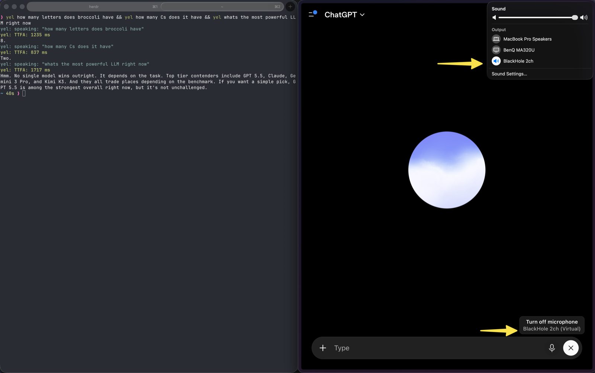

# yel

Drive a voice agent from your terminal, codex, Claude Code etc.

Use `yel` with GPT Live, Grok Voice, or any voice system that can use your Mac's
microphone input.

- Speak (yell) a prompt and wait for the reply.
- Transcribe the reply fully on-device.
- Print clean text to stdout.
- Chain commands to script conversations.



## Requirements

- macOS 26 or newer
- Python 3.11 or newer
- [`uv`](https://docs.astral.sh/uv/getting-started/installation/)
- [BlackHole 2ch](https://github.com/ExistentialAudio/BlackHole)
- Xcode 26 or its Command Line Tools for the first transcription run

Yel uses macOS `say` for speech and Apple Speech for transcription. No API key
or external speech service is required.

## Quick start

Install BlackHole:

```sh
brew install --cask blackhole-2ch
```

Configure your voice agent to:

1. Use `BlackHole 2ch` as its microphone.
2. Send or mirror its replies to `BlackHole 2ch`.

Run Yel directly from GitHub. No clone or persistent install is required:

```sh
uvx --from git+https://github.com/dmitri-b/yel.git yel "hello, can you hear me?"
```

For a shorter command, define this shell helper:

```sh
yel() { uvx --from git+https://github.com/dmitri-b/yel.git yel "$@"; }
```

Now you can run:

```sh
yel --devices # Check that BlackHole is available
yel "what is a quick Greek recipe?"
```

## How it works

```text
yel "hello!" → `say` → BlackHole → voice agent → BlackHole → Apple Speech ASR → stdout
```

Yel sends the prompt through BlackHole and stops after the reply goes quiet.
Apple Speech transcribes locally. Status and TTFA go to stderr; the transcript
goes to stdout.

Yel defaults both audio routes to `BlackHole 2ch` and does not use a physical
microphone. Run `yel --help` for all options.

## Examples

Chain turns. The second command starts after the first reply ends:

```sh
yel "recommend a Greek recipe under 30 minutes" \
  && yel "now give me the exact steps"
```

Capture the transcript:

```sh
reply=$(yel "what is a quick Greek recipe?")
echo "agent said: $reply"
```

Interrupt a long reply after five seconds:

```sh
yel "count from zero to 100" --timeout 5s \
  && yel "stop now"
```

Keep prompts and monitored replies off real speakers (useful when running from agent harness):

```sh
yel --no-speaker-output "what is a quick Greek recipe?"
```

## Development

```sh
git clone https://github.com/dmitri-b/yel.git
cd yel
uv sync
uv run pytest
uv run ruff check .
uv run mypy src
```

MIT licensed. See [LICENSE](LICENSE).
